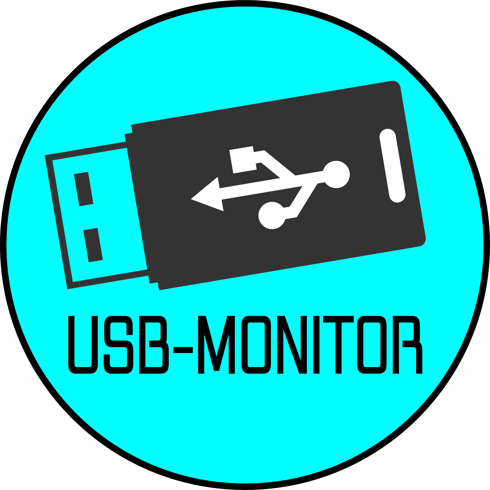

<div align="center">
  
  <h1>🔌 USB-Monitor</h1>
  <p>Ein modernes, plattformübergreifendes Programm zur Überwachung und Verwaltung von USB-Geräten und COM-Ports.</p>
</div>

## 🚀 Features

### 🔌 USB-Geräte-Überwachung
- **Automatische Erkennung**: Alle angeschlossenen USB-Geräte in Echtzeit
- **Erweiterte Informationen**: Stromverbrauch, Übertragungsgeschwindigkeit, USB-Version
- **Gerätetyp-Erkennung**: Intelligente Kategorisierung (Tastatur, Maus, Storage, etc.)
- **Kabel-Qualitätsbewertung**: Effizienz-Analyse basierend auf theoretischer vs. tatsächlicher Geschwindigkeit

### ⚡ USB-Geschwindigkeitstests
- **🚀 Speed-Test-Engine**: Echte Write/Read-Tests für USB-Storage-Geräte
- **Kabel-Diagnose**: Erkennt schlechte USB-Kabel durch Effizienz-Messung
- **Performance-Rating**: Automatische Bewertung der USB-Geschwindigkeit
- **Detaillierte Ergebnisse**: Schreib-/Lesegeschwindigkeit mit Optimierungstipps

### 📊 COM-Port-Management
- **Port-Überwachung**: Auflistung aller verfügbaren seriellen Ports
- **Verbindungsstatus**: Echtzeit-Überwachung von Port-Änderungen
- **Detaillierte Port-Informationen**: Baudrate, Hersteller, Gerätezuordnung

### 🎨 Moderne Benutzeroberfläche
- **Dark/Light Theme**: Automatisch oder manuell wählbar
- **Native Icons**: Plattformspezifische System-Icons
- **Sortierung & Gruppierung**: Flexible Tabellen-Organisation
- **Resizable Spalten**: Anpassbare Tabellenbreiten
- **macOS-Style Design**: Elegante, moderne Oberfläche

### 🔧 Erweiterte Funktionen
- **Plattformübergreifend**: Windows, macOS und Linux Support
- **Export-Funktionen**: JSON-Export aller Geräte- und Port-Daten
- **Echtzeit-Updates**: Kontinuierliche Überwachung von Änderungen
- **Suchfunktion**: Schnelles Finden von Geräten nach Name, Hersteller, etc.

## 📋 Voraussetzungen

- Python 3.9 oder höher
- pip (Python Package Manager)
- Plattformspezifische USB-Treiber

## 🛠️ Installation

### Option 1: Ausführbare Datei (Empfohlen)

#### Windows
1. Laden Sie die neueste `USB-Monitor.exe` aus dem [Releases](https://github.com/username/USB-Monitor/releases) Bereich herunter
2. Doppelklicken Sie auf die .exe-Datei
3. Keine Installation erforderlich!

#### macOS
1. Laden Sie die neueste `USB-Monitor.app` aus dem [Releases](https://github.com/username/USB-Monitor/releases) Bereich herunter
2. Ziehen Sie die .app-Datei in den Applications-Ordner
3. Starten Sie die Anwendung über den Finder

### Option 2: Aus dem Quellcode

#### 1. Repository klonen
```bash
git clone https://github.com/username/USB-Monitor.git
cd USB-Monitor
```

#### 2. Virtuelle Umgebung erstellen
```bash
# macOS/Linux
python -m venv venv
source venv/bin/activate

# Windows
python -m venv venv
venv\Scripts\activate
```

#### 3. Abhängigkeiten installieren
```bash
pip install -r requirements.txt
```

#### 4. Anwendung starten
```bash
python src/main.py
```

## 🔨 Eigene ausführbare Datei erstellen

### 🎯 Cross-Platform Build (Empfohlen)

**Erstellt automatisch beide Plattformen (.exe für Windows, .app für macOS)!**

#### Windows
```cmd
# Doppelklicken Sie auf build_all.bat
# Oder in der Kommandozeile:
build_all.bat
```

#### macOS/Linux
```bash
# Skript ausführbar machen
chmod +x build_all.sh

# Skript ausführen
./build_all.sh
```

#### Universelles Python-Skript
```bash
# Funktioniert auf allen Plattformen
python build_cross_platform.py
```

**Das Cross-Platform-Build-Skript erstellt automatisch beide ausführbaren Dateien und ein Download-Paket!**

**Detaillierte Build-Anleitung:** Siehe [BUILD_INSTRUCTIONS.md](BUILD_INSTRUCTIONS.md)

## 🎯 Verwendung

### Hauptfunktionen
1. **Geräte-Überwachung**: Automatische Erkennung aller USB-Geräte
2. **Port-Management**: Verwaltung und Überwachung von COM-Ports
3. **Echtzeit-Updates**: Kontinuierliche Aktualisierung der Gerätestatus
4. **Detaillierte Ansicht**: Umfassende Informationen zu jedem Gerät

### Tastenkombinationen
- `Ctrl/Cmd + R`: Geräteliste aktualisieren
- `Ctrl/Cmd + S`: Einstellungen öffnen
- `Ctrl/Cmd + Q`: Anwendung beenden
- `F5`: Aktualisieren

## 🖼️ Screenshots

*Screenshots werden nach der ersten Version hinzugefügt*

## 🏗️ Projektstruktur

```
USB-Monitor/
├── src/
│   ├── main.py              # Hauptanwendung
│   ├── ui/                  # Benutzeroberfläche
│   │   ├── main_window.py   # Hauptfenster
│   │   ├── device_panel.py  # Geräte-Panel
│   │   ├── port_panel.py    # Port-Panel
│   │   └── styles.py        # CSS-Styles
│   ├── core/                # Kernlogik
│   │   ├── device_monitor.py # USB-Geräte-Überwachung
│   │   └── port_monitor.py  # COM-Port-Überwachung
│   └── utils/               # Hilfsfunktionen
│       ├── platform_utils.py # Plattformspezifische Funktionen
│       └── config.py        # Konfiguration
├── build_cross_platform.py   # 🎯 Cross-Platform Build-Skript (Empfohlen)
├── build_all.bat             # Windows Cross-Platform Build
├── build_all.sh              # macOS/Linux Cross-Platform Build
├── requirements.txt          # Python-Abhängigkeiten
├── BUILD_INSTRUCTIONS.md     # Detaillierte Build-Anleitung
├── README.md                # Diese Datei
└── USB-Monitor.md           # Projekt-Dokumentation
```

## 🔧 Entwicklung

### Code-Standards
- **PEP 8**: Python-Codestil
- **Type Hints**: Vollständige Typisierung
- **Docstrings**: Umfassende Dokumentation

### Beitragen
1. Fork des Repositories
2. Feature-Branch erstellen
3. Änderungen implementieren
4. Tests hinzufügen
5. Pull Request einreichen

## 📄 Lizenz

MIT License - Siehe LICENSE-Datei für Details.

## 🤝 Support

Bei Fragen oder Problemen:
- GitHub Issues verwenden
- Dokumentation konsultieren
- Community-Forum besuchen

## 🙏 Danksagungen

Inspiriert von:
- [Open Serial Port Monitor](https://github.com/gthvidsten/open-serial-port-monitor)
- [USBDeview](https://github.com/Seabreg/usbdeview)
- [USBMonitor](https://github.com/CodeBerserkers888/USBMonitor)

## 📦 Distribution

### 🎯 Für Entwickler (Cross-Platform)

**Empfohlen: Verwenden Sie das Cross-Platform-Build-Skript!**

```bash
# Erstellt automatisch beide Plattformen
python build_cross_platform.py

# Ergebnis:
# - dist/USB-Monitor-Windows.exe (für Windows)
# - USB-Monitor.app (für macOS)
# - downloads/ (fertiges Verteilungspaket)
```

### 📱 Für Endbenutzer

**Windows-Benutzer:**
- Laden Sie `USB-Monitor.exe` herunter
- Doppelklicken Sie zum Starten
- Keine Installation erforderlich!

**macOS-Benutzer:**
- Laden Sie `USB-Monitor.app` herunter
- Ziehen Sie es in den Applications-Ordner
- Starten Sie über den Finder

### 🚀 Verteilung

**Einfachste Methode:**
1. Führen Sie `python build_cross_platform.py` aus
2. Verteilen Sie den gesamten `downloads/` Ordner
3. Benutzer wählen die passende Datei für ihre Plattform

## 🎉 Schnellstart für Entwickler

```bash
# 1. Repository klonen
git clone https://github.com/username/USB-Monitor.git
cd USB-Monitor

# 2. Cross-Platform Build (empfohlen)
python build_cross_platform.py

# 3. Fertig! Beide ausführbaren Dateien sind erstellt
# - Windows: dist/USB-Monitor-Windows.exe
# - macOS: USB-Monitor.app
# - Download-Paket: downloads/
```

## 🔍 Was passiert beim Cross-Platform Build?

1. **Automatische Plattform-Erkennung**
2. **Windows .exe erstellen** (auch auf macOS/Linux möglich)
3. **macOS .app Bundle erstellen** (auch auf Windows/Linux möglich)
4. **Download-Paket zusammenstellen** mit beiden Plattformen
5. **Automatische Bereinigung** temporärer Build-Dateien

**Das bedeutet: Sie können auf jeder Plattform beide ausführbaren Dateien erstellen!**
# Test workflow trigger
